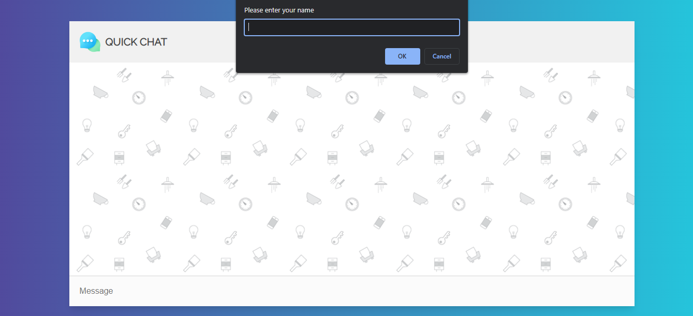
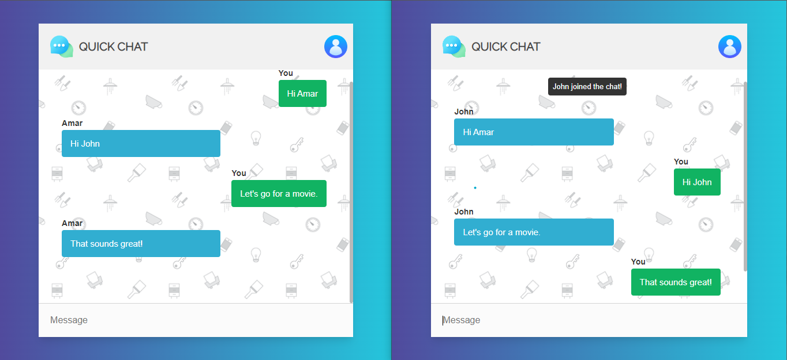

# Quick-Chat-App
- This is a simple group chat app with emoji support.
- This app is built using HTML, CSS, Vanilla Js, Node.js amd Socket.io library.
- This app has an amaizing UI with full responsiveness.

1. Homepage

    This is the first and only page of the chat app. When user visits this page a prompt will be show to enter the username. This name will help other member of the chat to identify the user.

2. Brand Section

    This contains the chat app name along with logo and an user icon on the right by hovering on which user can see his name.
 
3. Chat Box

    This is the main section on the app where all the messages send by the users will be appear. This section show a notification when a user joins or leaves the chat.
All the messages send by the user will be shown on right and received messages of the user will be shown on left.

4. Message Box
  
    This is the area which enables the users to compose their messages and on clicking on enter the composed message will be delivred to all the connected members of the chat app.
    
##Screenshots
###### Home Page

###### Home Page Chat

## Learnings by building this beautiful Chat App
- I got a better hold on the use of socket.io library.
- Learnt creating server in Node.js with express.

## Steps to run this project
- Clone it from gitHub and open the terminal inside the downloaded project and write node server.js then press enter.

### Hosted link: - https://simple-quick-chat-app.herokuapp.com/
